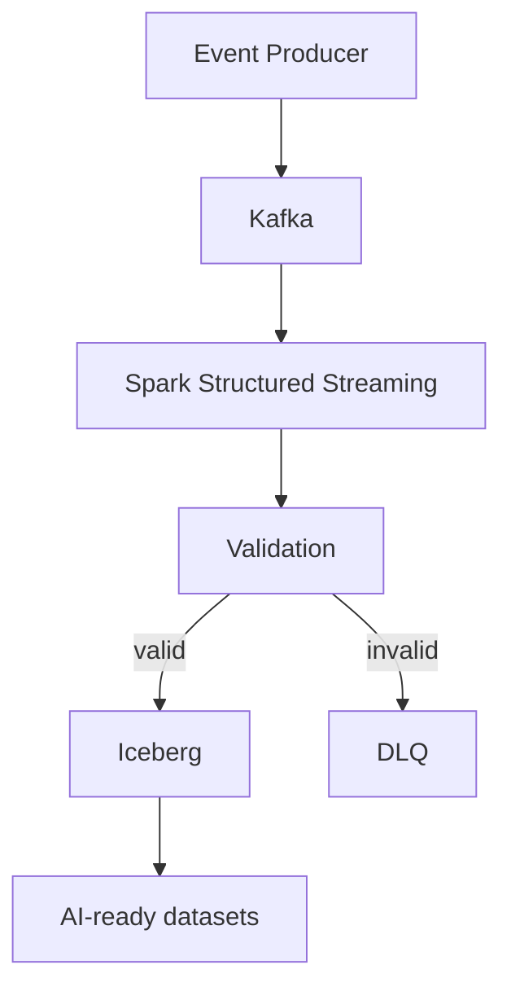

# AI-Ready Data Platform

## Overview

This is an evolving engineering project exploring how reliable data infrastructure supports AI, ML, analytics, and retrieval workloads.

The central idea is that AI systems are downstream consumers of data infrastructure. Models, features, embeddings, and retrieval pipelines inherit the quality of the data platform beneath them. Reliable AI depends on reliable ingestion, processing, schemas, data quality, reproducibility, and observability.

The repository is a public portfolio project. It will grow through small, reviewable increments rather than a single large implementation.

## Current Status

The first implemented components are a synthetic event producer (stdout), a local Kafka broker, and the `behavioral-events` topic.

Spark, Iceberg, validation, and the DLQ are not implemented yet. The producer is not connected to Kafka. There is no end-to-end pipeline.

## Planned Architecture

The diagram below is the **intended long-term direction**. It is not the current architecture.



The first implementation milestone will be a narrower path: synthetic events into Kafka, Spark Structured Streaming with basic validation, valid events into Iceberg, and invalid events into a DLQ.

## Engineering Goals

- Reproducible local development
- Explicit schemas
- Failure isolation
- Incremental architecture
- Data quality as a first-class concern
- Dataset reproducibility
- Observability
- Infrastructure that can evolve toward AI-ready datasets

## Roadmap

Development will happen one phase at a time. Each change should be small enough to review before the next step begins.

See [ROADMAP.md](ROADMAP.md) for the planned sequence.

## Running the Producer

Python 3.10+ is required. There are no third-party dependencies.

From the repository root:

```bash
python3 -m producer
```

Events are written as JSON lines to stdout. Stop with Ctrl+C.

The interval defaults to 1 second and can be changed with `--interval` or `PRODUCER_INTERVAL_SECONDS`:

```bash
python3 -m producer --interval 0.5
```

To emit a fixed number of events instead of running continuously:

```bash
python3 -m producer --count 5
```

## Local Kafka

Prerequisites: Docker with Docker Compose.

Start the broker:

```bash
docker compose up -d
```

Verify it is running and healthy:

```bash
docker compose ps
docker compose exec kafka /opt/kafka/bin/kafka-broker-api-versions.sh --bootstrap-server localhost:19092
```

The host bootstrap address is `localhost:19092`.

Broker log data is stored in the `kafka-data` Docker volume and survives `docker compose down`. Remove broker state with `docker compose down -v`.

Create or ensure the `behavioral-events` topic exists:

```bash
./scripts/ensure-behavioral-events-topic.sh
```

The script is safe to rerun. Automatic topic creation remains disabled on the broker.

List topics:

```bash
docker compose exec kafka /opt/kafka/bin/kafka-topics.sh --bootstrap-server localhost:19092 --list
```

Describe `behavioral-events`:

```bash
docker compose exec kafka /opt/kafka/bin/kafka-topics.sh --bootstrap-server localhost:19092 --describe --topic behavioral-events
```

Stop the broker:

```bash
docker compose down
```

## Project Status

**Status: Phase 1.3 — Behavioral Events Topic**

The producer, local Kafka broker, and `behavioral-events` topic exist. Remaining Phase 1 items are still unimplemented.
