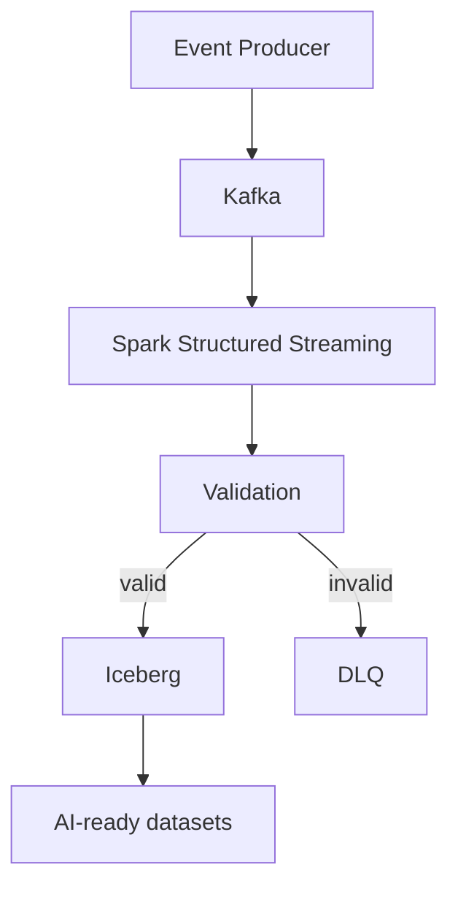

# AI-Ready Data Platform

## Overview

This is an evolving engineering project exploring how reliable data infrastructure supports AI, ML, analytics, and retrieval workloads.

The central idea is that AI systems are downstream consumers of data infrastructure. Models, features, embeddings, and retrieval pipelines inherit the quality of the data platform beneath them. Reliable AI depends on reliable ingestion, processing, schemas, data quality, reproducibility, and observability.

The repository is a public portfolio project. It will grow through small, reviewable increments rather than a single large implementation.

## Current Status

The repository is in the **project foundation / planning stage**.

No functional pipeline exists yet. There is no running producer, broker, stream processor, lakehouse table, or validation path. Kafka, Spark, Iceberg, and related components are planned, not implemented.

## Planned Architecture

The diagram below is the **intended long-term direction**. It is not the current architecture.

The first implementation milestone will be a narrower path: synthetic events into Kafka, Spark Structured Streaming with basic validation, valid events into Iceberg, and invalid events into a DLQ.

## Engineering Goals

- Reproducible local development
- Explicit schemas
- Failure isolation
- Incremental architecture
- Data quality as a first-class concern
- Dataset reproducibility
- Observability
- Infrastructure that can evolve toward AI-ready datasets

## Roadmap

Development will happen one phase at a time. Each change should be small enough to review before the next step begins.

See [ROADMAP.md](ROADMAP.md) for the planned sequence.

## Project Status

**Status: Planning / Foundation**

Implementation will begin with the first roadmap milestone after this foundation has been reviewed.
